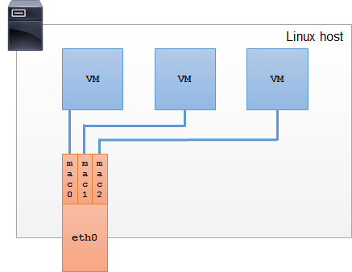

# Linux MacVLAN interface
{: .no_toc }

## Table of contents
{: .no_toc }

1. TOC
{:toc}

-----------------------------------
## Revision history

|| Revision | Date        | Remark                  |
|| :------- | :---------- | :---------------------- |
|| 0.1      | Jan-12-2023 | {{page.latest_release}} |

## Definition

    

        
    

    

    
- Macvlan is a virtual soft interface operating at layer 2, it's a sub-interface created from a physical interface. 
- The Kernel's network stack creates an interface with a different MAC address from the physical interface's MAC address. 
- The physical interface needs to support `promiscuity` mode to support transmitting and receiving packets with source and destination MAC addresses different from the physical interface's MAC address. 
- The Kernel routes packets between the virtual interface and physical interface based on the MAC address in the ethernet frame.

  

## Operating modes of macvlan interfaces

### Macvlan private

  

    
  

  

    
- In this mode, sub-interfaces cannot communicate with each other, meaning the Kernel doesn't route packets based on MAC to forward to the corresponding sub-interface. 
- All data is forwarded to the physical interface for external transmission.

  

### Macvlan VEPA

  

    
  

  

    
- In this mode, ethernet frames are inserted with specialized data. A VEPA-supporting Switch at the endpoint is required to forward packets back to the physical interface.

  

### Macvlan bridge

  

    
  

   

    
   - In this mode, packets between sub-interfaces are sent internally through a simple bridge. 
- Broadcast traffic is sent both internally between sub-interfaces and externally through the physical interface. 

  

### Macvlan passthrough

    

    
  

  

    
- In this mode, we only create one sub-interface and connect it directly to the physical interface. This way, we can change the MAC address and other interface parameters in the virtual machine without affecting the main interface.

  

## Disadvantages of macvlan

- Suppose a sub-interface (VM) wants to communicate with the parent interface (host), the VM sends the destination MAC as the host interface's MAC, the Kernel transmits this packet to the parent interface and sends it out to the switch. The switch cannot loop back to the same interface it just received from, leading to a limitation when using macvlan: VMs cannot communicate with the host and vice versa.

## How to create macvlan interface
See the article <a target="_blank" href="virtual_interface.html">Linux Virtual Interfaces</a>