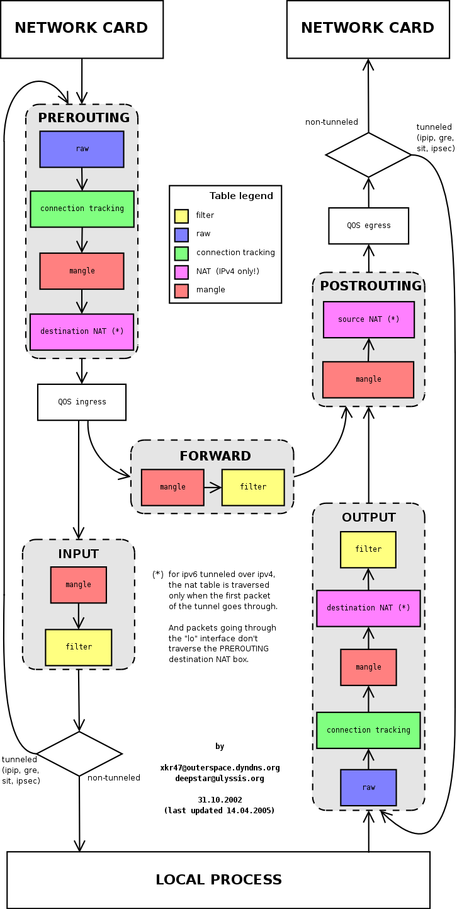
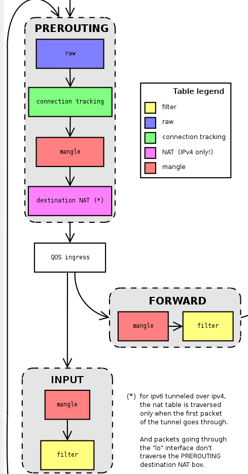
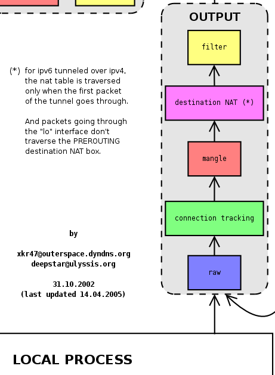
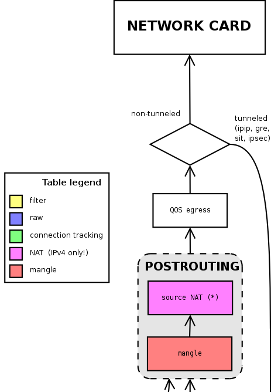

# Linux Packet Filtering
{: .no_toc }

## Table of contents
{: .no_toc }

1. TOC
{:toc}

-----------------------------------

## Revision history

| Revision | Date          | Remark      |
|:---------|:------------- |:------------|
| 0.1      | Feb-02-2023   | {{page.latest_release}} |

## Giới thiệu

- Để  chủ động điều khiển network của một Linux system, cần hiểu rõ đường đi của một gói tin từ lúc phần cứng nhận được nó cho đến khi gói tin được chuyển đến ứng dụng ở user space và ngược lại, một gói tin được sinh ra ở user space thì được chuyển đến phần cứng như thế nào.

## Chain

- Linux network thiết kế các gói tin sẽ đi qua các chain khác nhau tùy thuộc vào địa chỉ nguồn và địa chỉ đích của gói tin.
- Có 5 chain mặc định bao gồm PREROUTING, POSROUTING, FORWARD, INPUT, OUTPUT. Trong mỗi chain sẽ có những filter table, đây là các hook để Kernel cho phép người dùng điểu khiển gói tin sẽ được đi qua, bị loại bỏ, thay đổi nội dung của gói tin, hoặc đánh dấu gói tin để  để làm dữ liệu filter cho các filter table ở chain sau đó.

### Chain PREROUTING

    

    
- Đây là chain quan trọng, vì là chain đầu tiên mà package được đưa đến. 
- Sau khi ra khỏi chain PREROUTING, gói tin sẽ được đưa đến chain INPUT hoặc chain FORWARD phụ thuộc vào địa chỉ đích của gói tin. 
- Nếu địa chỉ đích là IP của host (người nhận chính là host) thì gói tin được đưa vào chain INPUT, tại đây gói tin tiếp tục được filter thông qua các filter table. Cuối cùng được kernel chuyển đến application đang chạy ở user space thông qua các port mà application này đăng ký. 
- Nếu địa chỉ đích không phải là IP của host thì gói tin được chuyển đến chain FORWARD, quy trình đi qua các filter table được lặp lại. 
- Có 2 filter table trên chain này là mangle table và nat table

  
<strong>Warning!</strong> Các rules mà user thiết lập trên filter tables của chain chỉ áp dụng cho gói tin đã được kernel đưa vào chain. Do đó để điểu khiển gói tin đi vào chain INPUT hay FORWARD ta cần điểu khiển trên chain phía trước nó.

 
- Ví dụ: Giả sử  ta cần mở một DNS server chạy local ở user-space. DNS server này sẽ kiểm tra tất cả các DNS request đến từ network card để lọc những request phân giải các tên miền độc hại. 

- Tuy nhiên chỉ khi trong package request chỉ định địa chỉ đích là địa chỉ của host thì gói tin này mới đến được chain INPUT và từ đó chuyển đến application. Khi địa chỉ đích là một địa chỉ external (ví dụ 8.8.8.8) thì gói tin được chuyển đến chain FORWARD và từ đó đi ra ngoài, application ở user space không thể nhận được. Để giải quyết vấn đề trên, ta cần thêm các rules ở chain PREROUTING để thay đổi địa chỉ đích của gói tin DNS request thành địa chỉ internal. Kết quả thay vì được đưa đến chain FORWARD thì gói tin được đưa đến chain INPUT 
  

  

        
    

### Chain INPUT

- Các gói tin đi đến chain INPUT xuất phát từ interface và có địa chỉ đích là IP của host (có thể là WAN, LAN , loop back)
- Outout của chain này được gửi đến các application.
- Có 2 filter table trên chain này là `mangle table` và `filter table`

### Chain FORWARD

- Các gói tin đi đến chain FORWARD xuất phát từ interface và có địa chỉ đích là IP external (không chứa bất kì một IP nào mà host đang có)
- Outout của chain này được gửi đến chain POSROUTING.
- Có 2 filter table trên chain này là `mangle table` và `filter table`

### Chain OUTPUT

    

    
- Các gói tin đi đến chain OUTPUT xuất phát từ application và có địa chỉ đích là IP external. 
- Outout của chain này được gửi đến chain POSROUTING. 
- Có 3 filter table trên chain này là `mangle table`, `nat table` và `filter table`

  

  

        
    

### Chain POSTROUTING

    

    
- Đây là nơi cuối cùng trước khi package được kernel chuyển đến driver để gửi ra ngoài. Đây là một chain quan trọng và được dùng nhiều nhất. 
- Trên hình ta có thể thấy nó nhận từ 2 chain OUTPUT và FORWARD. 
- Nếu thiết bị dạng client, thì dữ liệu đến nhiều từ chain OUTPUT khi có nhiều ứng dụng chạy và cần giao tiếp ra bên ngoài. 
- Trên các thiết bị Router thì vừa nhận từ chain OUTPUT do ứng dụng local đồng thời từ chain FORWARD từ các client của router gửi đến. 
- Có 2 filter table trên chain này là `mangle table` và `nat table`. Trên router thì `nat table` ngốn nhiều CPU nhất do phải thực hiển chuyển đổi địa chỉ source address thành địa chỉ IP của router của tất cả gói tin.

  

  

        
    

## Filter tables

- Mỗi chain sẽ có những filter tables, đây là nơi user sẽ thiết lập các quy tắc để kiểm soát gói tin.
- Các thiết lập này và vô cùng nhiều, đa dạng, phức tạp, do đó mình sẽ làm riêng một bài về nó.

## Công cụ để  cấu hình filter tables

- Công cụ nổi tiếng `iptables` thực hiện tương tác với kernel để tạo ra các rule này,
- Cú pháp `iptables [Command] [chain name: default all] -t [filter table: default filter] [option]`, sau đây là các lệnh cơ bản.

| Giải thích | Lệnh         |
|:---------|:------------- |
|**Chain OUTPUT**| |
| Liệt kê các rule đang có trên `nat table`, chain `OUTPUT`      | `iptables -nvL OUTPUT -t nat`  |
| Liệt kê các rule đang có trên `mangle table`, chain `OUTPUT`      | `iptables -nvL OUTPUT -t mangle`  |
| Liệt kê các rule đang có trên `filter table`, chain `OUTPUT`      | `iptables -nvL OUTPUT` or `iptables -nvL OUTPUT -t filter`  |
|**Chain FORWARD**| |
| Liệt kê các rule đang có trên `mangle table`, chain `FORWARD`      | `iptables -nvL FORWARD -t mangle`  |
| Liệt kê các rule đang có trên `filter table`, chain `FORWARD`      | `iptables -nvL FORWARD` or `iptables -nvL FORWARD -t filter`  |
| Liệt kê các rule đang có trên `nat table`, chain `FORWARD`      | `iptables -nvL FORWARD -t nat` : nếu có bài viết ở trên sai  |
|**Tất cả các chain**| |
| Liệt kê các rule đang có trên  `mangle table`      | `iptables -nvL -t mangle`  |
| Liệt kê các rule đang có trên  `filter table`      | `iptables -nvL` or `iptables -nvL -t filter`   |
| Liệt kê các rule đang có trên  `nat table`      | `iptables -nvL -t nat`   |

## Ví dụ: Dùng đường truyền WAN tốc độ thấp để định tuyến các mail request (TBD)

## References

- [https://www.linuxtopia.org/Linux_Firewall_iptables/c951.html](https://www.linuxtopia.org/Linux_Firewall_iptables/c951.html)
