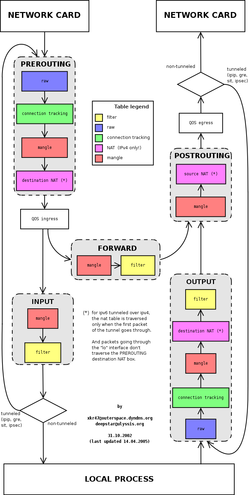
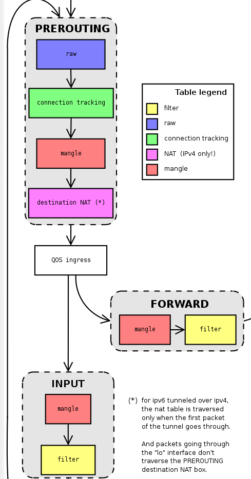
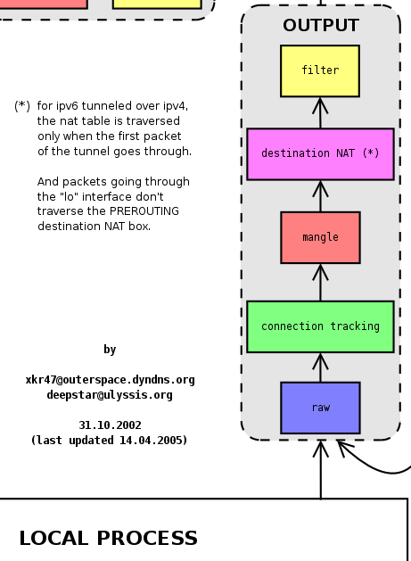
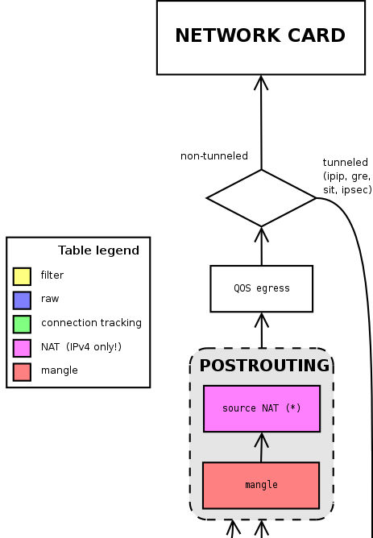

# Linux Packet Filtering
{: .no_toc }

## Table of contents
{: .no_toc }

1. TOC
{:toc}

-----------------------------------

## Revision history

|| Revision | Date          | Remark      |
||:---------|:------------- |:------------|
|| 0.1      | Feb-02-2023   | {{page.latest_release}} |

## Introduction

- To proactively control the network of a Linux system, it's essential to understand the path of a packet from when the hardware receives it until it's delivered to applications in user space, and conversely, how a packet generated in user space is transmitted to the hardware.

## Chain

- Linux networking is designed so that packets pass through different chains depending on their source and destination addresses.
- There are 5 default chains: PREROUTING, POSTROUTING, FORWARD, INPUT, and OUTPUT. Each chain contains filter tables, which are hooks that allow the kernel to let users control whether packets pass through, are dropped, have their content modified, or are marked for filtering in subsequent chains.

### Chain PREROUTING

    

    
- This is an important chain, as it's the first chain that packets are delivered to. 
- After leaving the PREROUTING chain, packets are sent to either the INPUT or FORWARD chain depending on the destination address. 
- If the destination address is the host's IP (the host is the recipient), the packet enters the INPUT chain, where it continues to be filtered through filter tables. Finally, the kernel delivers it to applications running in user space through the ports registered by these applications. 
- If the destination address is not the host's IP, the packet is sent to the FORWARD chain, where the filtering process is repeated. 
- There are 2 filter tables in this chain: mangle table and nat table

  
<strong>Warning!</strong> Rules that users set on chain filter tables only apply to packets that the kernel has already delivered to that chain. Therefore, to control whether packets enter the INPUT or FORWARD chain, we need to control them in the preceding chain.

 
- Example: Suppose we need to run a local DNS server in user-space. This DNS server will check all DNS requests coming from the network card to filter requests resolving malicious domain names. 

- However, only when the request packet specifies the destination address as the host's address will this packet reach the INPUT chain and then be forwarded to the application. When the destination address is an external address (e.g., 8.8.8.8), the packet is sent to the FORWARD chain and goes out, making it unreachable by user space applications. To solve this problem, we need to add rules in the PREROUTING chain to change the destination address of DNS request packets to an internal address. As a result, instead of being sent to the FORWARD chain, the packet is sent to the INPUT chain 
  

  

        
    

### Chain INPUT

- Packets arriving at the INPUT chain originate from an interface and have a destination address that is the host's IP (can be WAN, LAN, or loopback)
- The output of this chain is sent to applications.
- There are 2 filter tables in this chain: `mangle table` and `filter table`

### Chain FORWARD

- Packets arriving at the FORWARD chain originate from an interface and have an external IP as the destination address (not any IP that the host currently has)
- The output of this chain is sent to the POSTROUTING chain.
- There are 2 filter tables in this chain: `mangle table` and `filter table`

### Chain OUTPUT

    

    
- Packets arriving at the OUTPUT chain originate from applications and have an external IP as the destination address. 
- The output of this chain is sent to the POSTROUTING chain. 
- There are 3 filter tables in this chain: `mangle table`, `nat table`, and `filter table`

  

  

        
    

### Chain POSTROUTING

    

    
- This is the final point before the kernel transfers the packet to the driver for sending out. This is an important and most commonly used chain. 
- In the diagram, we can see it receives from 2 chains: OUTPUT and FORWARD. 
- On client devices, data mostly comes from the OUTPUT chain when many applications are running and need to communicate externally. 
- On Router devices, it receives from both the OUTPUT chain (from local applications) and the FORWARD chain (from router clients). 
- There are 2 filter tables in this chain: `mangle table` and `nat table`. On routers, the `nat table` consumes the most CPU as it must convert the source address to the router's IP address for all packets.

  

  

        
    

## Filter tables

- Each chain has filter tables, where users set rules to control packets.
- These settings are extremely numerous, diverse, and complex, so I'll create a separate article about them.

## Tools for configuring filter tables

- The famous `iptables` tool interacts with the kernel to create these rules.
- Syntax: `iptables [Command] [chain name: default all] -t [filter table: default filter] [option]`, here are the basic commands:

|| Explanation | Command         |
||:---------|:------------- |
||**Chain OUTPUT**| |
|| List current rules on `nat table`, chain `OUTPUT`      | `iptables -nvL OUTPUT -t nat`  |
|| List current rules on `mangle table`, chain `OUTPUT`      | `iptables -nvL OUTPUT -t mangle`  |
|| List current rules on `filter table`, chain `OUTPUT`      | `iptables -nvL OUTPUT` or `iptables -nvL OUTPUT -t filter`  |
||**Chain FORWARD**| |
|| List current rules on `mangle table`, chain `FORWARD`      | `iptables -nvL FORWARD -t mangle`  |
|| List current rules on `filter table`, chain `FORWARD`      | `iptables -nvL FORWARD` or `iptables -nvL FORWARD -t filter`  |
|| List current rules on `nat table`, chain `FORWARD`      | `iptables -nvL FORWARD -t nat` : if the above article is wrong  |
||**All chains**| |
|| List current rules on `mangle table`      | `iptables -nvL -t mangle`  |
|| List current rules on `filter table`      | `iptables -nvL` or `iptables -nvL -t filter`   |
|| List current rules on `nat table`      | `iptables -nvL -t nat`   |

## Example: Using low-speed WAN connection to route mail requests (TBD)

## References

- [https://www.linuxtopia.org/Linux_Firewall_iptables/c951.html](https://www.linuxtopia.org/Linux_Firewall_iptables/c951.html)